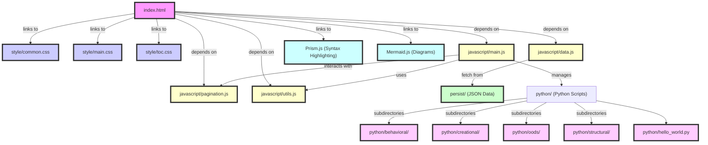

## Project Description

A website that explains Design Patterns and Object-Oriented Designs according to Lymeng Naret.

## Project Design

This diagram represents a high-level view of the architecture.

